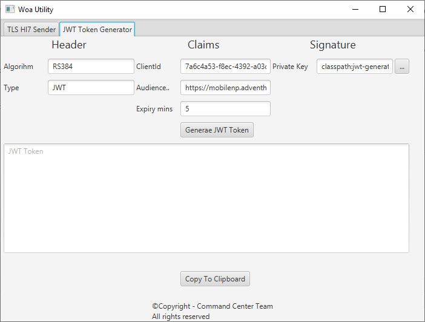

# Utilities

Set of simple utilities

# Secured Hl7 Sender


## Features
- Automatically saves the last known configuration
- Supports TLS

# JWT Token Generator


## Features
- Generates jwt token
## Usage
- Build the app using ```mvn clean install``` and use the executable jar from the target directory