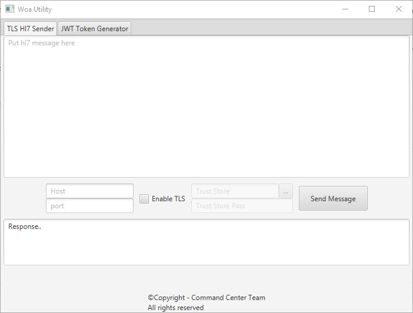

# hl7-sender

A simple hl7 sender utility that supports TLS



## Features
- Automatically saves the last known configuration
- Supports TLS
## Usage
- Build the app using ```mvn clean install``` and use the executable jar from the target directory